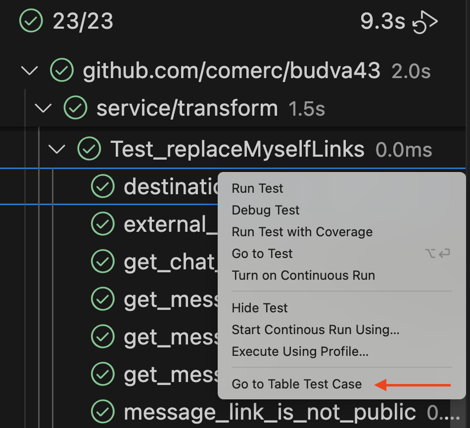

# Go Table Test Navigator

[](https://github.com/comerc/go-table-test-navigator/actions/workflows/test.yml)
[](https://opensource.org/licenses/MIT)
[](https://github.com/comerc/go-table-test-navigator/releases/latest)

A VS Code extension that allows you to navigate directly to specific table test cases in Go files from the Test Explorer.

## ⚠️ Important Requirements

This extension requires **BOTH** of the following to work properly:

1. **Official Go extension** in **Prerelease** mode
2. **[Go Companion](https://github.com/firelizzard18/exp-vscode-go)** extension installed

## Features

- **Navigate to Table Test Cases**: Right-click on a table test case in the Test Explorer and select "Go to Table Test Case" to jump directly to the corresponding line in your Go test file.
- **Smart Detection**: Automatically detects table-driven test cases in Go test files.
- **Seamless Integration**: Works with VS Code's built-in Test Explorer and Go testing framework.

## Manual Installation

1. Download `golang-go-to-impl-*.vsix` from [latest release](https://github.com/comerc/go-table-test-navigator/releases/latest).
2. Open Command Palette `Ctrl+Shift+P` (`Cmd+Shift+P` on Mac).
3. Type ">Extensions: Install from VSIX..." and select the downloaded file.

> Also available on [open-vsx.org](https://open-vsx.org/extension/comerc/go-table-test-navigator)

## Usage

1. Open a Go project with table-driven tests
2. Run your tests to populate the Test Explorer
3. Right-click on any table test case
4. Select "Go to Table Test Case" from the context menu
5. The extension will open the test file and navigate to the specific test case

## Example

For a test like this:

```go
func TestExample(t *testing.T) {
    tests := []struct {
        name string
        input int
        want int
    }{
        {"positive", 5, 5},
        {"negative", -3, 3},
        {"zero", 0, 0},
    }
    
    for _, tt := range tests {
        t.Run(tt.name, func(t *testing.T) {
            // test implementation
        })
    }
}
```

When you right-click on the `positive` test case in the Test Explorer, the extension will navigate directly to the line with `{"positive", 5, 5}`.

## Search Logic

The extension uses a two-step search approach:

1. **Priority search**: Looks for `name: "test_case"` patterns (with any amount of whitespace)
2. **Fallback search**: Looks for `"test_case"` in quotes anywhere in the code

The search is context-aware and only looks within the correct test function to handle cases where multiple tests have similar case names.

## Requirements

- VS Code 1.75.0 or higher
- Go extension for VS Code
- Go projects with table-driven tests

## Contributing

Contributions are welcome! Please feel free to submit a Pull Request.

## License

MIT © [comerc](https://github.com/comerc)

## Demo

